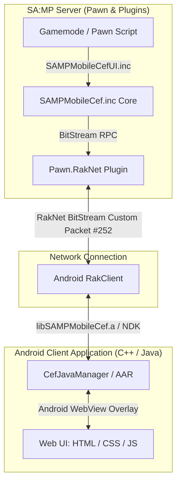
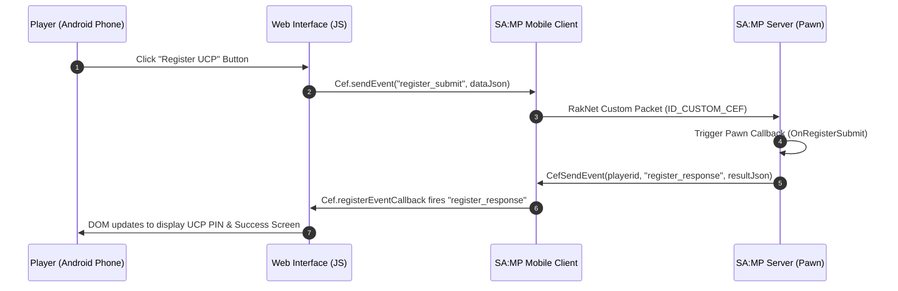

# 🚀 SA:MP Mobile CEF (Chromium Embedded Framework)

<p align="center">
  
</p>

<p align="center">
  <a href="CHANGELOG.md"></a>
  <a href="https://open.mp"></a>
  <a href="https://sa-mp.mp"></a>
  <a href="https://github.com/4x11/build69"></a>
  <a href="LICENSE"></a>
</p>

---

## 📌 Overview

**SA:MP Mobile CEF** is a state-of-the-art bridge library designed for **GTA San Andreas Multiplayer (SA:MP) Mobile Android clients**. It embeds an Android **WebView (Chromium)** seamlessly into the game overlay, empowering server developers to build modern, fluid, and responsive user interfaces using standard web technologies (**HTML5, CSS3, JavaScript, React, Vue, Tailwind CSS**).

> **Bahasa Indonesia:**  
> SA:MP Mobile CEF adalah library jembatan yang memasukkan **WebView (Chromium)** ke dalam aplikasi GTA SA:MP Android. Dengan ini, developer server dapat membuat tampilan UI (Login, UCP, Inventory, Shop, Dialog, Notifikasi) menggunakan HTML5, CSS3, dan JavaScript di layar HP pemain.

---

## ⚡ SA:MP TextDraw vs SA:MP Mobile CEF

| Feature / Capability | Old SA:MP TextDraws | 🚀 SA:MP Mobile CEF |
|---|:---:|:---:|
| **Design & Layout** | Fixed pixel boxes, basic fonts | Full HTML5, CSS3, Flexbox, Grid |
| **Styling & Effects** | None / Static colors | Glassmorphism, Shadows, Blur, Animations |
| **Framework Support** | None | React, Vue, Svelte, Tailwind CSS |
| **External APIs / OAuth2** | ❌ Impossible | ✅ Supported (`fetch`, Axios, Discord Login) |
| **Audio Playback** | Standard SA:MP Audio Stream | Custom HTML5 Audio / SFX Player |
| **Interactive Components** | Basic click box | Search bars, Dropdowns, Drag & Drop Inventory |
| **Responsive Mobile UI** | Fixed resolution | Auto-scalable (`CefSetBrowserZoom`) |

---

## 📑 Table of Contents
- [✨ Key Features](#-key-features)
- [🏗️ System Architecture & Event Flow](#️-system-architecture--event-flow)
- [📦 Includes & Modules](#-includes--modules)
- [🚀 Quick Start Guide](#-quick-start-guide)
- [📖 Core Pawn API (`SAMPMobileCef.inc`)](#-core-pawn-api-sampmobilecefinc)
- [🎨 Streamlined UI API (`SAMPMobileCefUI.inc`)](#-streamlined-ui-api-sampmobilecefuiinc)
- [🌐 JavaScript Web API Reference](#-javascript-web-api-reference)
- [💡 Real-World Code Examples](#-real-world-code-examples)
- [❓ Frequently Asked Questions (FAQ)](#-frequently-asked-questions-faq)
- [📝 Changelog & License](#-changelog--license)

---

## ✨ Key Features

- **Full WebView Lifecycle Control**: Initialize, show, hide, reload, toggle, zoom/scale, and update URL/focus from Pawn.
- **Server Event Anti-Spam Guard**: Built-in rate limiter protecting the server from JavaScript event spam (`CefSetEventRateLimit`).
- **Streamlined High-Level UI Framework (`SAMPMobileCefUI.inc`)**:
  - 🔔 **Notifications & Toasts**: Instant pop-up alerts with custom types (`info`, `success`, `warning`, `error`).
  - 💬 **Web Dialog & Input Modals**: Native replacement for SA:MP dialogs (`CefShowDialog`, `CefShowInputDialog`).
  - 📋 **List & Table Dialogs**: Interactive tables with search bars (`CefShowListDialog`).
  - 🎵 **HTML5 Audio Player**: Trigger background music or UI sound effects from web URLs (`CefPlayAudio`).
  - 🎒 **Inventory Grid Framework**: Complete grid-based inventory open/close handlers (`CefOpenInventory`).
- **Classic Dialog Callbacks**: Native gamemode hooks for `OnCefDialogResponse`, `OnCefListDialogResponse`, and `OnCefInventoryUseItem`.
- **Dynamic JavaScript Execution**: Run custom JS strings on player devices dynamically with `CefExecuteJavaScript`.
- **Bi-Directional Communication**: Event-driven architecture between Pawn and JavaScript (`CefSendEvent` ↔ `Cef.registerEventCallback`).

---

## 🏗️ System Architecture & Event Flow

### System Architecture Diagram


### Event Interaction Sequence


---

## 📦 Includes & Modules

This repository provides two server-side Pawn includes located in `server/`:

1. **[SAMPMobileCef.inc](file:///home/drgxel/Documents/samp/samp-mobile-cef/server/SAMPMobileCef.inc)**: Core low-level include handling RakNet packet RPCs, anti-spam rate limiting, screen scaling, state tracking, and raw event transmission.
2. **[SAMPMobileCefUI.inc](file:///home/drgxel/Documents/samp/samp-mobile-cef/server/SAMPMobileCefUI.inc)**: Streamlined, lightweight UI framework for Notifications, Web Dialogs, Searchable Lists, HTML5 Audio, and Inventory Grids.

---

## 🚀 Quick Start Guide

### 1. Include Libraries in Gamemode
```pawn
#include <open.mp> // or #include <a_samp>
#include <Pawn.RakNet>
#include <json>
#include <gvar>

#include <SAMPMobileCef>
#include <SAMPMobileCefUI>

#define CEF_PACKET_ID 252

public OnGameModeInit()
{
    // Set network packet ID & rate limit
    CefSetPacketId(CEF_PACKET_ID);
    CefSetEventRateLimit(20); // 20 events/sec per player
    return 1;
}

public OnPlayerConnect(playerid)
{
    // Initialize Web UI for player
    CefInitBrowser(playerid, "file:///android_asset/cef/index.html");
    return 1;
}
```

### 2. Connect JavaScript Frontend
```javascript
// Register callback to listen for server events
Cef.registerEventCallback("welcome_message", function(eventDataJson) {
    const data = JSON.parse(eventDataJson);
    console.log("Welcome Message from Server:", data[0]);
});

// Send an event back to Pawn server
function triggerAction(actionName) {
    Cef.sendEvent("player_action", JSON.stringify([actionName]));
}
```

---

## 📖 Core Pawn API (`SAMPMobileCef.inc`)

### Browser Lifecycle & Management

| Function | Signature | Description |
|---|---|---|
| `CefSetPacketId` | `CefSetPacketId(packet_id)` | Configures network packet ID for CEF communication. |
| `CefSetEventRateLimit` | `CefSetEventRateLimit(max_events_per_sec)` | Configures server-side anti-spam rate limiter. |
| `CefInitBrowser` | `CefInitBrowser(playerid, const url[])` | Initializes player WebView with specified URL. |
| `CefDestroyBrowser` | `CefDestroyBrowser(playerid)` | Destroys player WebView instance. |
| `CefShowBrowser` | `CefShowBrowser(playerid)` | Shows player WebView overlay. |
| `CefHideBrowser` | `CefHideBrowser(playerid)` | Hides player WebView overlay. |
| `CefToggleBrowser` | `CefToggleBrowser(playerid, bool:show)` | Toggles WebView visibility. |
| `CefIsBrowserShown` | `bool:CefIsBrowserShown(playerid)` | Returns `true` if browser is currently shown. |
| `CefSetBrowserZoom` | `CefSetBrowserZoom(playerid, Float:scale)` | Scales Web UI zoom factor (e.g. 1.25 for 1080p/2K). |
| `CefGetBrowserZoom` | `Float:CefGetBrowserZoom(playerid)` | Retrieves player's current zoom scale factor. |
| `CefSetBrowserUrl` | `CefSetBrowserUrl(playerid, const url[])` | Changes active URL for player WebView. |
| `CefGetBrowserUrl` | `CefGetBrowserUrl(playerid, dest[], maxlen)` | Retrieves current active URL. |
| `CefReloadBrowser` | `CefReloadBrowser(playerid)` | Reloads current active URL. |
| `CefResetBrowser` | `CefResetBrowser(playerid)` | Complete reset of player WebView state. |

### Event Communication & Execution

| Function | Signature | Description |
|---|---|---|
| `CefSendEvent` | `CefSendEvent(playerid, event_name[], event_data[])` | Sends JSON event to player WebView. |
| `CefSendEventToAll` | `CefSendEventToAll(event_name[], event_data[])` | Broadcasts JSON event to all online players. |
| `CefExecuteJavaScript` | `CefExecuteJavaScript(playerid, const code[])` | Executes custom JavaScript code string in player WebView. |
| `CefExecuteJavaScriptToAll` | `CefExecuteJavaScriptToAll(const code[])` | Broadcasts custom JavaScript code to all players. |
| `CefRegisterEventCallback` | `CefRegisterEventCallback(event_name[], callback[])` | Registers Pawn callback for client event. |
| `CefUnregisterEventCallback` | `bool:CefUnregisterEventCallback(event_name[])` | Removes registered callback. |
| `CefHasEventCallback` | `bool:CefHasEventCallback(event_name[])` | Checks if callback is currently registered. |
| `CefIsPlayerHasLibrary` | `bool:CefIsPlayerHasLibrary(playerid)` | Checks if player client supports CEF. |
| `CefGetInitializedPlayerCount` | `CefGetInitializedPlayerCount()` | Returns total online players with CEF initialized. |

---

## 🎨 Streamlined UI API (`SAMPMobileCefUI.inc`)

### 1. Notifications & Toasts
```pawn
// Show toast notification to player
CefShowNotification(playerid, "Transaksi Berhasil", "Uang $5,000 telah ditambahkan", "success", 3000);

// Broadcast notification to all players
CefShowNotificationToAll("Server Event", "Double EXP event telah dimulai!", "info", 5000);
```

### 2. Web Dialogs & Modals (SA:MP Dialog Style)
```pawn
// Message Box Dialog
CefShowDialog(playerid, DIALOG_RULES, "Peraturan Server", "Dilarang menggunakan cheat/mod ilegal!", "Setuju", "Tutup");

// Input Dialog
CefShowInputDialog(playerid, DIALOG_LOGIN, "Login Akun", "Masukkan password akun UCP Anda:", "Login", "Batal", true);

// Searchable List / Table Dialog
new garage_items[] = "[\"Infernus - $1,500,000\", \"Turismo - $1,200,000\", \"Bullet - $1,100,000\"]";
CefShowListDialog(playerid, DIALOG_GARAGE, "Garasi Kendaraan", garage_items, "Pilih", "Batal");

// Automatic Callback Hooks in Gamemode
public OnCefDialogResponse(playerid, dialogid, response, const inputtext[])
{
    if (dialogid == DIALOG_LOGIN && response)
    {
        printf("Player %d entered password: %s", playerid, inputtext);
    }
    return 1;
}

public OnCefListDialogResponse(playerid, dialogid, response, item_index, const item_value[])
{
    if (dialogid == DIALOG_GARAGE && response)
    {
        printf("Player %d selected vehicle #%d: %s", playerid, item_index, item_value);
    }
    return 1;
}
```

### 3. HTML5 Audio & SFX Player
```pawn
// Play Sound Effect / Background Audio from Web URL
CefPlayAudio(playerid, "https://example.com/sfx/welcome.mp3", false, 0.8);

// Stop Audio Playback
CefStopAudio(playerid);

// Adjust Volume (0.0 to 1.0)
CefSetAudioVolume(playerid, 0.5);
```

### 4. Inventory Grid Framework
```pawn
// Open Inventory Grid
new items[] = "[{\"id\":1, \"name\":\"Medkit\", \"count\":3}, {\"id\":2, \"name\":\"Repair Kit\", \"count\":1}]";
CefOpenInventory(playerid, items);

// Item Use Callback
public OnCefInventoryUseItem(playerid, slot_id, const item_name[])
{
    printf("Player %d used %s from slot %d", playerid, item_name, slot_id);
    return 1;
}
```

---

## 🌐 JavaScript Web API Reference

| Function | Signature | Description |
|---|---|---|
| `Cef.registerEventCallback` | `Cef.registerEventCallback(eventName, callbackFn)` | Registers JavaScript function to respond to Pawn server events. |
| `Cef.sendEvent` | `Cef.sendEvent(eventName, eventDataJson)` | Sends JSON event payload from Web UI back to Pawn server. |

---

## 💡 Real-World Code Examples

- 🔔 **Basic Notification & Alert**: [example.pwn](file:///home/drgxel/Documents/samp/samp-mobile-cef/example/server/example.pwn) & [example/web/](file:///home/drgxel/Documents/samp/samp-mobile-cef/example/web/)
- 🔐 **Glassmorphism UCP Registration & Discord UI**: [example/register/](file:///home/drgxel/Documents/samp/samp-mobile-cef/example/register/)

---

## ❓ Frequently Asked Questions (FAQ)

<details>
<summary><b>1. Bisakah file HTML/CSS/JS ditaruh di server web hosting biasa (HTTPS)?</b></summary>
<br>
<b>Ya, tentu saja!</b> Selain disimpan di dalam asset APK Android (<code>file:///android_asset/cef/index.html</code>), Anda juga bisa memuat URL web online seperti <code>https://yourdomain.com/cef/index.html</code>.
</details>

<details>
<summary><b>2. Apakah ini memberatkan performa HP pemain (FPS drop)?</b></summary>
<br>
Tidak. Android WebView menggunakan perakitan GPU bawaan Android (Hardware Acceleration). Ketika UI disembunyikan dengan <code>CefHideBrowser</code>, WebView tidak memakan konsumsi render layar.
</details>

<details>
<summary><b>3. Bisakah melakukan fetch API luar (misal: Discord Bot / REST API)?</b></summary>
<br>
<b>Bisa!</b> Karena ini adalah lingkungan Chromium utuh, JavaScript di Web UI dapat menggunakan <code>fetch()</code> atau <code>axios</code> untuk mengakses REST API eksternal.
</details>

<details>
<summary><b>4. Apakah kompatibel dengan open.mp?</b></summary>
<br>
<b>100% Kompatibel.</b> Semua include Pawn sudah dites dan bekerja lancar di gamemode <code>open.mp</code> maupun SA-MP 0.3.7 standar.
</details>

---

## 📝 Changelog & License

See detailed release notes and version history in [CHANGELOG.md](CHANGELOG.md).

**Copyright © 2024-2026 [Denis Akazuki & Community](https://github.com/denis-akazuki)**  
Licensed under the **MIT License**.
