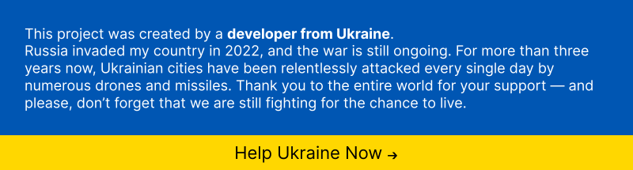
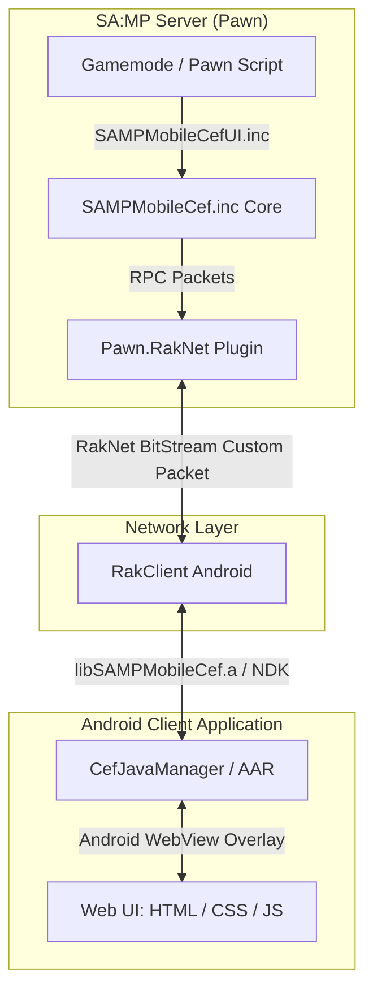

# 🚀 SA:MP Mobile CEF (Chromium Embedded Framework)



[](CHANGELOG.md)
[](https://sa-mp.mp)
[](https://open.mp)
[](https://github.com/4x11/build69)
[](LICENSE)

**SA:MP Mobile CEF** is a powerful, ready-made bridge library designed for **GTA San Andreas Multiplayer (SA:MP) Mobile Android clients**. It integrates an Android **WebView (Chromium)** directly into the game overlay, allowing server developers to create stunning, modern, and interactive user interfaces using standard web technologies (**HTML5, CSS3, JavaScript, React, Vue, Tailwind CSS**).

---

## 📑 Table of Contents
- [✨ Key Features](#-key-features)
- [🏗️ System Architecture](#️-system-architecture)
- [📦 Includes & Modules](#-includes--modules)
- [🚀 Quick Start & Installation](#-quick-start--installation)
- [📖 Core Pawn API (SAMPMobileCef.inc)](#-core-pawn-api-sampmobilecefinc)
- [🎨 Streamlined UI Framework (SAMPMobileCefUI.inc)](#-streamlined-ui-framework-sampmobilecefuiinc)
- [🌐 JavaScript Web API Reference](#-javascript-web-api-reference)
- [💡 Usage Examples](#-usage-examples)
- [📝 Changelog](#-changelog)

---

## ✨ Key Features

- **Full WebView Control**: Initialize, show, hide, reload, toggle, scale/zoom, and change URL/focus directly from Pawn.
- **Anti-Spam Event Rate Limiter**: Server-side protection against JavaScript event flooding (`CefSetEventRateLimit`).
- **Streamlined UI Framework (`SAMPMobileCefUI.inc`)**:
  - 🔔 Toast Notifications (`CefShowNotification`)
  - 💬 Message & Input Modals (`CefShowDialog`, `CefShowInputDialog`)
  - 📋 Interactive List & Table Dialogs (`CefShowListDialog`)
  - 🎵 HTML5 Audio & Sound Player (`CefPlayAudio`, `CefStopAudio`)
  - 🎒 Inventory Grid Framework (`CefOpenInventory`)
- **Classic Dialog Callbacks**: Native support for `OnCefDialogResponse`, `OnCefListDialogResponse`, and `OnCefInventoryUseItem`.
- **Dynamic JavaScript Execution**: Execute custom JS strings on player devices with `CefExecuteJavaScript`.
- **External Web & API Capabilities**: Full support for `fetch()`, REST APIs, OAuth2 authentication (e.g. Discord login), web fonts, and CSS animations.

---

## 🏗️ System Architecture



---

## 📦 Includes & Modules

This repository provides two server-side Pawn includes located in `server/`:

1. **[SAMPMobileCef.inc](file:///home/drgxel/Documents/samp/samp-mobile-cef/server/SAMPMobileCef.inc)**: Core low-level include handling RakNet packet RPCs, rate-limiting, browser scaling, state tracking, and raw event transmission.
2. **[SAMPMobileCefUI.inc](file:///home/drgxel/Documents/samp/samp-mobile-cef/server/SAMPMobileCefUI.inc)**: Lightweight, streamlined UI framework for Notifications, Web Dialogs, List Tables, Audio, and Inventory.

---

## 🚀 Quick Start & Installation

Include both headers in your Pawn gamemode:
```pawn
#include <Pawn.RakNet>
#include <json>
#include <gvar>

#include <SAMPMobileCef>
#include <SAMPMobileCefUI>

#define CEF_PACKET_ID 252

public OnGameModeInit()
{
    CefSetPacketId(CEF_PACKET_ID);
    CefSetEventRateLimit(20); // Limit to 20 events/sec per player
    return 1;
}

public OnPlayerConnect(playerid)
{
    CefInitBrowser(playerid, "file:///android_asset/cef/index.html");
    return 1;
}
```

---

## 📖 Core Pawn API (SAMPMobileCef.inc)

| Function | Description |
|---|---|
| `CefSetPacketId(packet_id)` | Configures network packet ID for CEF communication. |
| `CefSetEventRateLimit(max_events_per_sec)` | Configures server-side anti-spam rate limiter. |
| `CefInitBrowser(playerid, const url[])` | Initializes player WebView with specified URL. |
| `CefDestroyBrowser(playerid)` | Destroys player WebView instance. |
| `CefShowBrowser(playerid)` | Shows player WebView overlay. |
| `CefHideBrowser(playerid)` | Hides player WebView overlay. |
| `CefToggleBrowser(playerid, bool:show)` | Toggles WebView visibility. |
| `CefIsBrowserShown(playerid)` | Returns `true` if browser is currently shown. |
| `CefSetBrowserZoom(playerid, Float:scale)` | Scales Web UI zoom factor (e.g. 1.25 for 1080p/2K). |
| `CefGetBrowserZoom(playerid)` | Retrieves player's current zoom scale factor. |
| `CefSetBrowserUrl(playerid, const url[])` | Changes active URL for player WebView. |
| `CefGetBrowserUrl(playerid, dest[], maxlen)` | Retrieves current active URL. |
| `CefReloadBrowser(playerid)` | Reloads current active URL. |
| `CefResetBrowser(playerid)` | Complete reset of player WebView state. |
| `CefSendEvent(playerid, const event_name[], const event_data[])` | Sends JSON event to player WebView. |
| `CefSendEventToAll(const event_name[], const event_data[])` | Broadcasts JSON event to all players. |
| `CefExecuteJavaScript(playerid, const code[])` | Executes custom JavaScript string in player WebView. |
| `CefExecuteJavaScriptToAll(const code[])` | Broadcasts custom JavaScript execution to all players. |

---

## 🎨 Streamlined UI Framework (SAMPMobileCefUI.inc)

### Notifications & Toasts
```pawn
CefShowNotification(playerid, "Success", "Item purchased successfully!", "success", 3000);
CefShowNotificationToAll("Server Event", "Double EXP event is now active!", "info", 5000);
```

### Web Dialogs & Modals
```pawn
// Show MessageBox Dialog
CefShowDialog(playerid, DIALOG_RULES, "Rules", "Welcome to the server! Follow the rules.", "Agree", "Close");

// Show Input Dialog
CefShowInputDialog(playerid, DIALOG_LOGIN, "Login", "Enter your account password:", "Login", "Cancel", true);

// Show List / Table Dialog with Search Bar
new items_json[] = "[\"Infernus - $1,500,000\", \"Turismo - $1,200,000\", \"Bullet - $1,100,000\"]";
CefShowListDialog(playerid, DIALOG_GARAGE, "Vehicle Dealership", items_json, "Buy", "Cancel");

// Handle Dialog Responses in Callbacks
public OnCefDialogResponse(playerid, dialogid, response, const inputtext[])
{
    if (dialogid == DIALOG_LOGIN && response)
    {
        printf("Player %d entered password: %s", playerid, inputtext);
    }
    return 1;
}

public OnCefListDialogResponse(playerid, dialogid, response, item_index, const item_value[])
{
    if (dialogid == DIALOG_GARAGE && response)
    {
        printf("Player %d selected item #%d: %s", playerid, item_index, item_value);
    }
    return 1;
}
```

### HTML5 Audio & SFX Player
```pawn
// Play Background Music or Sound Effect
CefPlayAudio(playerid, "https://example.com/sfx/welcome.mp3", false, 0.8);

// Stop Audio
CefStopAudio(playerid);
```

### Inventory Grid UI
```pawn
// Open Inventory Grid
new inv_items[] = "[{\"id\":1, \"name\":\"Medkit\", \"count\":3}, {\"id\":2, \"name\":\"Repair Kit\", \"count\":1}]";
CefOpenInventory(playerid, inv_items);

// Handle Item Use Callback
public OnCefInventoryUseItem(playerid, slot_id, const item_name[])
{
    printf("Player %d used %s from slot %d", playerid, item_name, slot_id);
    return 1;
}
```

---

## 📝 Changelog

See detailed release notes and version history in [CHANGELOG.md](CHANGELOG.md).

---

**Copyright © 2024-2026 [Denis Akazuki & Community](https://github.com/denis-akazuki)**  
Licensed under the MIT License.
