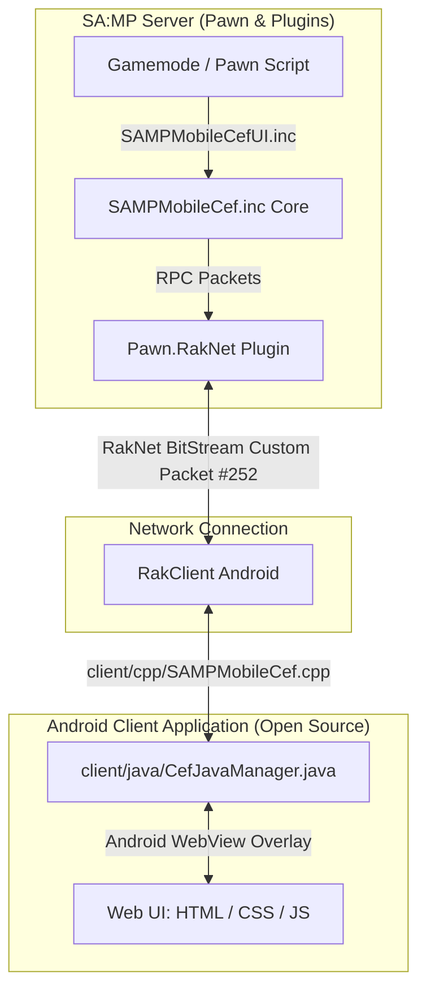

# 🚀 SA:MP Mobile CEF (Chromium Embedded Framework)

<p align="center">
  
</p>

<p align="center">
  <a href="CHANGELOG.md"></a>
  <a href="https://open.mp"></a>
  <a href="https://sa-mp.mp"></a>
  <a href="https://github.com/4x11/build69"></a>
  <a href="LICENSE"></a>
</p>

---

## 👥 Credits & Authors

- **Original Concept & Creator**: **[Denis Akazuki](https://github.com/denis-akazuki)** (Original SA:MP Mobile CEF concept & base library)
- **Upgraded Framework & Open-Source Client Implementation**: **[drgxbytezone & Community](https://github.com/drgxbytezone)** (Complete C++ NDK & Java open-source client files, `SAMPMobileCefUI.inc`, rate limiting, screen scaling, `CefEmit`, Confirm Dialogs, Context Menus)

---

## 📌 Overview

**SA:MP Mobile CEF** is a state-of-the-art, open-source bridge ecosystem designed for **GTA San Andreas Multiplayer (SA:MP) Mobile Android clients**. It embeds an Android **WebView (Chromium)** seamlessly into the game overlay, empowering server developers to build modern, fluid, and responsive user interfaces using standard web technologies (**HTML5, CSS3, JavaScript, React, Vue, Tailwind CSS**).

> **Bahasa Indonesia:**  
> SA:MP Mobile CEF adalah ekosistem library open-source yang memasukkan **WebView (Chromium)** ke dalam aplikasi GTA SA:MP Android. Dengan ini, developer server dapat membuat antarmuka UI (Login, UCP, Inventory, Shop, Dialog, Notifikasi) menggunakan HTML5, CSS3, dan JavaScript di layar HP pemain.

---

## ⚡ SA:MP TextDraw vs SA:MP Mobile CEF

| Feature / Capability | Old SA:MP TextDraws | 🚀 SA:MP Mobile CEF |
|---|:---:|:---:|
| **Design & Layout** | Fixed pixel boxes, basic fonts | Full HTML5, CSS3, Flexbox, Grid |
| **Styling & Effects** | Static colors | Glassmorphism, Shadows, Blur, Animations |
| **Framework Support** | None | React, Vue, Svelte, Tailwind CSS |
| **External APIs / OAuth2** | ❌ Impossible | ✅ Supported (`fetch`, Axios, Discord Login) |
| **Audio Playback** | Standard SA:MP Audio Stream | Custom HTML5 Audio / SFX Player |
| **Interactive Components** | Basic click box | Search bars, Dropdowns, Context Menus, Grids |
| **Responsive Mobile UI** | Fixed resolution | Auto-scalable (`CefSetBrowserZoom`) |
| **Client Source Code** | Closed / Proprietary | 100% Open-Source (`client/cpp/` & `client/java/`) |

---

## 📑 Table of Contents
- [👥 Credits & Authors](#-credits--authors)
- [✨ Key Features](#-key-features)
- [🏗️ System Architecture](#️-system-architecture)
- [📂 Open-Source Repository Modules](#-open-source-repository-modules)
- [🚀 Quick Start Guide](#-quick-start-guide)
  - [1. Server-Side Setup (Pawn)](#1-server-side-setup-pawn)
  - [2. Client-Side Setup (C++ NDK & Java)](#2-client-side-setup-c-ndk--java)
- [📖 Core Pawn API (`SAMPMobileCef.inc`)](#-core-pawn-api-sampmobilecefinc)
- [🎨 Streamlined UI API (`SAMPMobileCefUI.inc`)](#-streamlined-ui-api-sampmobilecefuiinc)
- [💻 Native C++ Client API](#-native-c-client-api)
- [📱 Java Android Client API](#-java-android-client-api)
- [🌐 JavaScript Web API Reference](#-javascript-web-api-reference)
- [💡 Real-World Code Examples](#-real-world-code-examples)
- [❓ Frequently Asked Questions (FAQ)](#-frequently-asked-questions-faq)
- [📝 Changelog & License](#-changelog--license)

---

## ✨ Key Features

- **100% Open-Source Client & Server Code**: Includes complete inspectable C++ NDK and Java Android Studio source files inside `client/`.
- **Formatted Data Transmission (`CefEmit` / `CefEmitToAll`)**: Send formatted events directly from Pawn using `format` syntax without JSON boilerplate.
- **Full WebView Lifecycle Control**: Initialize, show, hide, reload, clear cache, toggle, scale/zoom, and change URL/focus directly from Pawn.
- **Anti-Spam Event Rate Limiter**: Server-side protection against JavaScript event flooding (`CefSetEventRateLimit`).
- **Streamlined High-Level UI Framework (`SAMPMobileCefUI.inc`)**:
  - 🔔 **Toast Notifications**: Instant pop-up alerts (`CefShowNotification`, `CefShowNotificationToAll`).
  - 💬 **Web Dialog & Input Modals**: Native replacement for SA:MP dialogs (`CefShowDialog`, `CefShowInputDialog`, `CefShowConfirmDialog`).
  - 📋 **List & Context Menus**: Interactive tables with search bars (`CefShowListDialog`, `CefShowContextMenu`).
  - 🎵 **HTML5 Audio Player**: Trigger background music or UI sound effects from web URLs (`CefPlayAudio`).
  - 🎒 **Inventory Grid Framework**: Complete grid-based inventory open/close handlers (`CefOpenInventory`).
- **Classic Dialog Callbacks**: Native gamemode hooks for `OnCefDialogResponse`, `OnCefListDialogResponse`, `OnCefConfirmDialogResponse`, `OnCefContextMenuResponse`, and `OnCefInventoryUseItem`.
- **Dynamic JavaScript Execution**: Run custom JS strings on player devices dynamically with `CefExecuteJavaScript`.

---

## 🏗️ System Architecture



---

## 📂 Open-Source Repository Modules

This repository provides full, inspectable source code for both client and server:

### 1. Server-Side Includes (`server/`)
- **[SAMPMobileCef.inc](file:///home/drgxel/Documents/samp/samp-mobile-cef/server/SAMPMobileCef.inc)**: Core low-level include handling RakNet packet RPCs, rate-limiting, browser scaling, state tracking, `CefEmit`, and raw event transmission.
- **[SAMPMobileCefUI.inc](file:///home/drgxel/Documents/samp/samp-mobile-cef/server/SAMPMobileCefUI.inc)**: Streamlined UI framework for Notifications, Modals, Searchable Lists, Confirm Dialogs, Context Menus, Audio, and Inventory.

### 2. Client-Side Source Files (`client/`)
- **C++ NDK Layer**:
  - [client/cpp/SAMPMobileCef.h](file:///home/drgxel/Documents/samp/samp-mobile-cef/client/cpp/SAMPMobileCef.h) (Header)
  - [client/cpp/SAMPMobileCef.cpp](file:///home/drgxel/Documents/samp/samp-mobile-cef/client/cpp/SAMPMobileCef.cpp) (Source Implementation)
- **Java Android Layer**:
  - [client/java/CefJavaManager.java](file:///home/drgxel/Documents/samp/samp-mobile-cef/client/java/CefJavaManager.java) (WebView Overlay Manager)
  - [client/java/CefClientManager.java](file:///home/drgxel/Documents/samp/samp-mobile-cef/client/java/CefClientManager.java) (JNI Bridge Manager)

---

## 🚀 Quick Start Guide

### 1. Server-Side Setup (Pawn)

```pawn
#include <open.mp> // or #include <a_samp>
#include <Pawn.RakNet>
#include <json>
#include <gvar>

#include <SAMPMobileCef>
#include <SAMPMobileCefUI>

#define CEF_PACKET_ID 252

public OnGameModeInit()
{
    CefSetPacketId(CEF_PACKET_ID);
    CefSetEventRateLimit(20); // 20 events/sec per player
    return 1;
}

public OnPlayerConnect(playerid)
{
    CefInitBrowser(playerid, "file:///android_asset/cef/index.html");
    return 1;
}
```

---

## 📖 Core Pawn API (`SAMPMobileCef.inc`)

| Function | Signature | Description |
|---|---|---|
| `CefSetPacketId` | `CefSetPacketId(packet_id)` | Configures network packet ID for CEF communication. |
| `CefSetEventRateLimit` | `CefSetEventRateLimit(max_events_per_sec)` | Configures server-side anti-spam rate limiter. |
| `CefEmit` | `CefEmit(playerid, event_name[], format_str[], ...)` | Sends formatted JSON event directly using format syntax. |
| `CefEmitToAll` | `CefEmitToAll(event_name[], format_str[], ...)` | Broadcasts formatted JSON event to all online players. |
| `CefInitBrowser` | `CefInitBrowser(playerid, const url[])` | Initializes player WebView with specified URL. |
| `CefDestroyBrowser` | `CefDestroyBrowser(playerid)` | Destroys player WebView instance. |
| `CefShowBrowser` | `CefShowBrowser(playerid)` | Shows player WebView overlay. |
| `CefHideBrowser` | `CefHideBrowser(playerid)` | Hides player WebView overlay. |
| `CefToggleBrowser` | `CefToggleBrowser(playerid, bool:show)` | Toggles WebView visibility. |
| `CefIsBrowserShown` | `bool:CefIsBrowserShown(playerid)` | Returns `true` if browser is currently shown. |
| `CefSetBrowserZoom` | `CefSetBrowserZoom(playerid, Float:scale)` | Scales Web UI zoom factor (e.g. 1.25 for 1080p/2K). |
| `CefGetBrowserZoom` | `Float:CefGetBrowserZoom(playerid)` | Retrieves player's current zoom scale factor. |
| `CefClearBrowserCache` | `CefClearBrowserCache(playerid)` | Remotely clears localStorage, sessionStorage, and reloads. |
| `CefSetBrowserUrl` | `CefSetBrowserUrl(playerid, const url[])` | Changes active URL for player WebView. |
| `CefGetBrowserUrl` | `CefGetBrowserUrl(playerid, dest[], maxlen)` | Retrieves current active URL. |
| `CefReloadBrowser` | `CefReloadBrowser(playerid)` | Reloads current active URL. |
| `CefResetBrowser` | `CefResetBrowser(playerid)` | Complete reset of player WebView state. |
| `CefSendEvent` | `CefSendEvent(playerid, event_name[], event_data[])` | Sends JSON event to player WebView. |
| `CefSendEventToAll` | `CefSendEventToAll(event_name[], event_data[])` | Broadcasts JSON event to all players. |
| `CefExecuteJavaScript` | `CefExecuteJavaScript(playerid, const code[])` | Executes custom JavaScript code string in player WebView. |
| `CefExecuteJavaScriptToAll` | `CefExecuteJavaScriptToAll(const code[])` | Broadcasts custom JavaScript code to all players. |

---

## 🎨 Streamlined UI API (`SAMPMobileCefUI.inc`)

### 1. Notifications & Toasts
```pawn
CefShowNotification(playerid, "Success", "Item purchased successfully!", "success", 3000);
CefShowNotificationToAll("Server Event", "Double EXP event is now active!", "info", 5000);
```

### 2. Web Dialogs, Modals, & Context Menus
```pawn
// MessageBox & Input Modals
CefShowDialog(playerid, DIALOG_RULES, "Rules", "Welcome to the server!", "Agree", "Close");
CefShowInputDialog(playerid, DIALOG_LOGIN, "Login", "Enter password:", "Login", "Cancel", true);

// Confirm Dialog (Yes / No)
CefShowConfirmDialog(playerid, DIALOG_BUY, "Purchase", "Do you want to buy Infernus for $1,500,000?", "Yes", "No");

// Searchable List / Table Dialog
new garage_items[] = "[\"Infernus - $1,500,000\", \"Turismo - $1,200,000\", \"Bullet - $1,100,000\"]";
CefShowListDialog(playerid, DIALOG_GARAGE, "Garage", garage_items, "Buy", "Cancel");

// Interactive Context Menu
new options[] = "[\"Inspect Player\", \"Trade\", \"Invite to Faction\"]";
CefShowContextMenu(playerid, MENU_PLAYER, "Player Actions", options);

// Callbacks
public OnCefDialogResponse(playerid, dialogid, response, const inputtext[]) { ... }
public OnCefConfirmDialogResponse(playerid, dialogid, response) { ... }
public OnCefContextMenuResponse(playerid, menu_id, item_index, const item_value[]) { ... }
```

### 3. HTML5 Audio & SFX Player
```pawn
CefPlayAudio(playerid, "https://example.com/sfx/welcome.mp3", false, 0.8);
CefStopAudio(playerid);
```

---

## 💻 Native C++ Client API

Located in [client/cpp/SAMPMobileCef.h](file:///home/drgxel/Documents/samp/samp-mobile-cef/client/cpp/SAMPMobileCef.h):

| Function | Description |
|---|---|
| `cef::setGamePath(const char* szPath)` | Configures client game storage path for logging (`SAMP/cef.log`). |
| `cef::initNetwork(void* pRakClient, uint8_t packetId)` | Binds RakClient pointer and custom packet ID (e.g. 252). |
| `cef::sendClientEvent(const char* name, const char* data)` | Serializes and sends client JavaScript event to SA:MP Server. |
| `cef::handlePacket(void* pPacket)` | Parses incoming RakNet BitStream packets from SA:MP Server. |
| `cef::handleServerConnection()` | Sends initial `RPC_LibraryInit` packet to SA:MP Server. |
| `cef::log(const char* fmt, ...)` | Writes formatted debug log entries to `SAMP/cef.log`. |

---

## 📱 Java Android Client API

Located in [client/java/CefJavaManager.java](file:///home/drgxel/Documents/samp/samp-mobile-cef/client/java/CefJavaManager.java):

| Function | Description |
|---|---|
| `CefJavaManager(FrameLayout rootLayout, Activity activity)` | Constructor initializing hardware-accelerated WebView overlay. |
| `loadUrl(String url)` | Loads web interface URL into WebView. |
| `showBrowserView()` / `hideBrowserView()` | Toggles WebView visibility overlay with smooth fade animation. |
| `isShow()` | Returns `true` if WebView is currently visible. |
| `sendEvent(String eventName, String eventDataJson)` | `@JavascriptInterface` bridge (`window.AndroidCefBridge`). |

---

## 🌐 JavaScript Web API Reference

| Function | Signature | Description |
|---|---|---|
| `Cef.registerEventCallback` | `Cef.registerEventCallback(eventName, callbackFn)` | Registers JavaScript function to respond to Pawn server events. |
| `Cef.sendEvent` | `Cef.sendEvent(eventName, eventDataJson)` | Sends JSON event payload from Web UI back to Pawn server. |

---

## 💡 Real-World Code Examples

- 🔔 **Basic Notification & Alert**: [example.pwn](file:///home/drgxel/Documents/samp/samp-mobile-cef/example/server/example.pwn) & [example/web/](file:///home/drgxel/Documents/samp/samp-mobile-cef/example/web/)
- 🔐 **Glassmorphism UCP Registration & Discord UI**: [example/register/](file:///home/drgxel/Documents/samp/samp-mobile-cef/example/register/)

---

## ❓ Frequently Asked Questions (FAQ)

<details>
<summary><b>1. Bisakah file HTML/CSS/JS ditaruh di server web hosting biasa (HTTPS)?</b></summary>
<br>
<b>Ya, tentu saja!</b> Selain disimpan di dalam asset APK Android (<code>file:///android_asset/cef/index.html</code>), Anda juga bisa memuat URL web online seperti <code>https://yourdomain.com/cef/index.html</code>.
</details>

<details>
<summary><b>2. Apakah ini memberatkan performa HP pemain (FPS drop)?</b></summary>
<br>
Tidak. Android WebView menggunakan perakitan GPU bawaan Android (Hardware Acceleration). Ketika UI disembunyikan dengan <code>CefHideBrowser</code>, WebView tidak memakan konsumsi render layar.
</details>

<details>
<summary><b>3. Bisakah melakukan fetch API luar (misal: Discord Bot / REST API)?</b></summary>
<br>
<b>Bisa!</b> Karena ini adalah lingkungan Chromium utuh, JavaScript di Web UI dapat menggunakan <code>fetch()</code> atau <code>axios</code> untuk mengakses REST API eksternal.
</details>

<details>
<summary><b>4. Apakah kompatibel dengan open.mp?</b></summary>
<br>
<b>100% Kompatibel.</b> Semua include Pawn sudah dites dan bekerja lancar di gamemode <code>open.mp</code> maupun SA-MP 0.3.7 standar.
</details>

---

## 📝 Changelog & License

See detailed release notes and version history in [CHANGELOG.md](CHANGELOG.md).

**Original Copyright © 2024 [Denis Akazuki](https://github.com/denis-akazuki)**  
**Upgraded Framework & Client Code Copyright © 2026 [drgxbytezone & Community](https://github.com/drgxbytezone)**  
Licensed under the **MIT License**.
