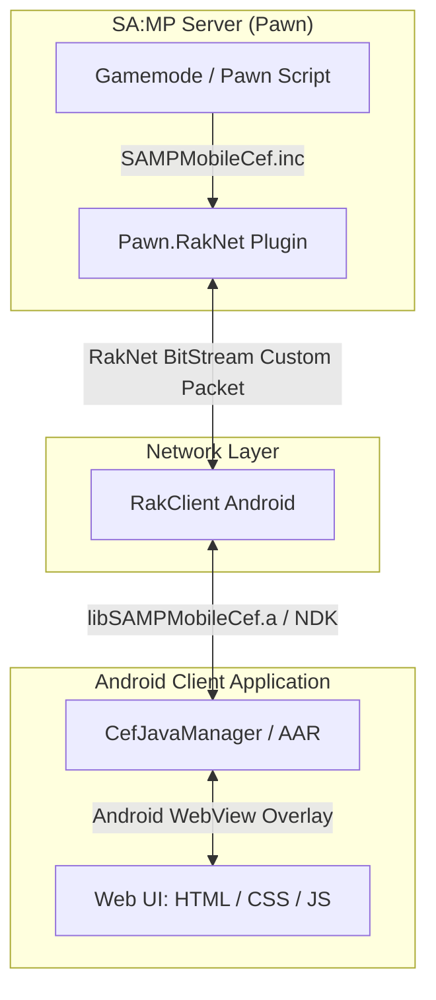

# 🚀 SA:MP Mobile CEF (Chromium Embedded Framework)


[](CHANGELOG.md)
[](https://sa-mp.mp)
[](https://open.mp)
[](https://github.com/4x11/build69)
[](LICENSE)

**SA:MP Mobile CEF** is a powerful, ready-made bridge library designed for **GTA San Andreas Multiplayer (SA:MP) Mobile Android clients**. It integrates an Android **WebView (Chromium)** directly into the game overlay, allowing server developers to create stunning, modern, and interactive user interfaces using standard web technologies (**HTML5, CSS3, JavaScript, React, Vue, Tailwind CSS**).

---

## 📑 Table of Contents
- [✨ Key Features](#-key-features)
- [🏗️ System Architecture](#️-system-architecture)
- [📦 Prerequisites](#-prerequisites)
- [🚀 Quick Start & Installation](#-quick-start--installation)
  - [1. Server-Side Installation (Pawn)](#1-server-side-installation-pawn)
  - [2. Client-Side Installation (C++ / Java)](#2-client-side-installation-c--java)
  - [3. Web-Side Frontend (HTML/CSS/JS)](#3-web-side-frontend-htmlcssjs)
- [📖 Pawn Server API Reference](#-pawn-server-api-reference)
- [🌐 JavaScript Web API Reference](#-javascript-web-api-reference)
- [💡 Usage Examples](#-usage-examples)
- [📝 Changelog](#-changelog)

---

## ✨ Key Features

- **Full WebView Control**: Initialize, show, hide, reload, toggle, and change URL/focus directly from Pawn scripts.
- **Bi-Directional Communication**: Seamless event-based communication between Pawn server scripts and Web UI (`CefSendEvent` ↔ `Cef.registerEventCallback`).
- **Dynamic JavaScript Execution**: Execute custom JS strings on player devices with `CefExecuteJavaScript`.
- **Broadcast Events**: Send events or execute JS across all connected players simultaneously with `CefSendEventToAll` and `CefExecuteJavaScriptToAll`.
- **Player State Tracking**: Real-time state queries for browser visibility (`CefIsBrowserShown`) and active URL (`CefGetBrowserUrl`).
- **External Web & API Capabilities**: Full support for `fetch()`, REST APIs, OAuth2 authentication (e.g. Discord login), web fonts, and animations inside the game.
- **open.mp & SA:MP Compatible**: Fully compatible with both standard SA-MP servers and `open.mp` gamemodes.

---

## 🏗️ System Architecture



---

## 📦 Prerequisites

Before installing the server-side library, ensure your gamemode has the following dependencies included:
1. **[Pawn.RakNet](https://github.com/katursis/Pawn.RakNet)** (Network packet manipulation)
2. **[pawn-json](https://github.com/Southclaws/pawn-json)** (JSON packing/unpacking)
3. **[SA-MP GVar Plugin](https://github.com/samp-incognito/samp-gvar-plugin)** (Global variable storage for callbacks)

---

## 🚀 Quick Start & Installation

### 1. Server-Side Installation (Pawn)

1. Download [SAMPMobileCef.inc](file:///home/drgxel/Documents/samp/samp-mobile-cef/server/SAMPMobileCef.inc) and place it in your `pawno/include/` directory.
2. Include the required libraries in your gamemode:
   ```pawn
   #include <Pawn.RakNet>
   #include <json>
   #include <gvar>
   #include <SAMPMobileCef>
   ```
3. Set the network packet ID in `OnGameModeInit`:
   ```pawn
   #define CEF_PACKET_ID 252

   public OnGameModeInit()
   {
       CefSetPacketId(CEF_PACKET_ID);
       return 1;
   }
   ```
4. Load the Web UI when a player connects:
   ```pawn
   public OnPlayerConnect(playerid)
   {
       CefInitBrowser(playerid, "file:///android_asset/cef/index.html");
       return 1;
   }
   ```

### 2. Client-Side Installation (C++ / Java)

Refer to detailed client installation guides:
- [Client Integration Guide (English)](docs/en/client.md)
- [Client Integration Guide (Ukrainian)](docs/uk/client.md)

### 3. Web-Side Frontend (HTML/CSS/JS)

Include standard JavaScript logic in your HTML interface to interact with the Pawn server:
```javascript
// Register callback to listen for server events
Cef.registerEventCallback("alert_show", function(eventDataJson) {
    console.log("Received data from server:", JSON.parse(eventDataJson));
});

// Send an event back to the Pawn server
function sendResponseToServer(resultData) {
    Cef.sendEvent("alert_response", JSON.stringify(resultData));
}
```

---

## 📖 Pawn Server API Reference

### Core Browser Management

| Function | Description |
|---|---|
| `CefSetPacketId(packet_id)` | Configures network packet ID for CEF communication. |
| `CefInitBrowser(playerid, const url[])` | Initializes player WebView with specified URL. |
| `CefDestroyBrowser(playerid)` | Destroys player WebView instance. |
| `CefShowBrowser(playerid)` | Shows player WebView overlay. |
| `CefHideBrowser(playerid)` | Hides player WebView overlay. |
| `CefToggleBrowser(playerid, bool:show)` | Toggles WebView visibility. |
| `CefIsBrowserShown(playerid)` | Returns `true` if browser is currently shown. |
| `CefSetBrowserUrl(playerid, const url[])` | Changes active URL for player WebView. |
| `CefGetBrowserUrl(playerid, dest[], maxlen)` | Retrieves current active URL. |
| `CefReloadBrowser(playerid)` | Reloads current active URL. |
| `CefResetBrowser(playerid)` | Complete reset of player WebView state. |
| `CefChangeBrowserFocus(playerid, bool:is_focused)` | Enables or disables touch/keyboard focus. |
| `CefSetBrowserFocusAll(bool:is_focused)` | Toggles browser focus for all online players. |

### Event Communication & Script Execution

| Function | Description |
|---|---|
| `CefSendEvent(playerid, const event_name[], const event_data[])` | Sends JSON event to player WebView. |
| `CefSendEventToAll(const event_name[], const event_data[])` | Broadcasts JSON event to all players. |
| `CefExecuteJavaScript(playerid, const code[])` | Executes custom JavaScript string in player WebView. |
| `CefExecuteJavaScriptToAll(const code[])` | Broadcasts custom JavaScript execution to all players. |
| `CefRegisterEventCallback(const event_name[], const callback[])` | Registers Pawn callback for client event. |
| `CefUnregisterEventCallback(const event_name[])` | Removes registered callback. |
| `CefHasEventCallback(const event_name[])` | Checks if callback is currently registered. |
| `CefIsPlayerHasLibrary(playerid)` | Checks if player client supports CEF. |
| `CefGetInitializedPlayerCount()` | Returns total online players with CEF initialized. |

---

## 🌐 JavaScript Web API Reference

| Function | Description |
|---|---|
| `Cef.registerEventCallback(eventName, callbackFunction)` | Registers JavaScript function to respond to Pawn server events. |
| `Cef.sendEvent(eventName, eventDataJson)` | Sends JSON event payload from Web UI back to Pawn server. |

---

## 💡 Usage Examples

Explore ready-to-use demo implementations:
- 🔔 **Basic Notification Alert**: [example.pwn](file:///home/drgxel/Documents/samp/samp-mobile-cef/example/server/example.pwn) & [example/web/](file:///home/drgxel/Documents/samp/samp-mobile-cef/example/web/)
- 🔐 **Glassmorphism UCP Registration & Discord UI**: [example/register/](file:///home/drgxel/Documents/samp/samp-mobile-cef/example/register/)

---

## 📝 Changelog

See detailed release notes and version history in [CHANGELOG.md](CHANGELOG.md).

---

**Copyright © 2024 [Denis Akazuki](https://github.com/denis-akazuki)**  
Licensed under the MIT License.
